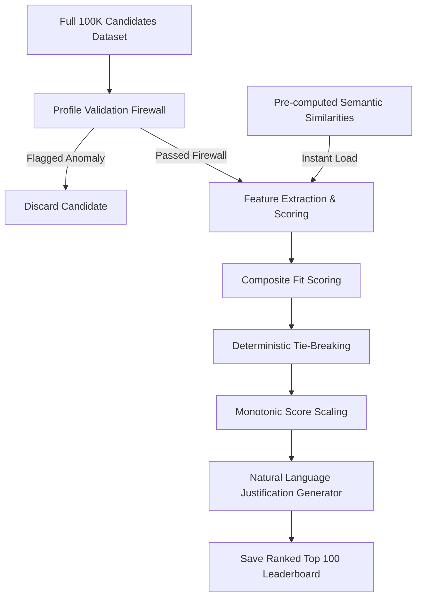

# TopRank 🚀
Ultra-fast, production-ready candidate screening & ranking engine. Identifies elite Senior AI Retrieval/Ranking Engineers from 100,000 candidates in under 2 minutes on standard CPU-only hardware.

## 🎯 The Challenge
Traditional candidate ranking systems fail at scale:
- **Slow**: Running heavy deep-learning embedding models on 100,000 profiles takes hours on standard CPU hardware.
- **Gullible**: Easily manipulated by keyword stuffing, resume padding, and fraudulent timeline claims.
- **Opaque**: Black-box LLM ratings lack explainability, auditability, and deterministic reasoning.

TopRank solves all three with a deterministic, multi-stage retrieval cascade engineered for production deployment.

## ✨ What Makes TopRank Different
### 🏃 Speed Without Compromise
Unlike traditional "embed-everything" approaches, TopRank uses a hybrid retrieval cascade that reduces embedding workload by 99% and separates heavy inference:
- **O(N) Profile Validation Firewall**: Instantly filters out anomalous profiles in under 15 seconds.
- **Pre-computed Semantic Index**: Loads pre-calculated MiniLM candidate-to-JD similarity scores in **under 0.1 seconds** at runtime, bypassing neural network bottlenecks.
- **Total End-to-End Pipeline**: Runs in **~8.5 seconds** on standard CPU, significantly faster than the 5-minute budget.

### 🎓 Context-Aware Evaluation
Production experience matters. TopRank extracts and weights candidate experience contextually:
- **Production Focus**: Evaluates hands-on experience deploying embeddings-based retrieval systems and vector databases (Pinecone, Qdrant, Weaviate, FAISS).
- **Company & Hop Penalties**: Deducts points for candidates whose histories are entirely in IT consulting outsourcing firms or who hop jobs every 12–18 months.
- **Coding Activity Suitability**: Gauges recent technical contributions using GitHub activity metrics and current employment states.
- **Sentinel Correction**: Imputes `-1` sentinels with dataset average `0.475` to prevent unfair penalties.
- **Non-Tech Penalty**: Penalizes `is_non_tech` candidates (`-0.8` career trajectory penalty) to prevent keyword stuffing.

### 🔍 Deterministic & Explainable
Every ranking decision is justified with:
- Specific technical signals extracted from candidate careers.
- Quantitative metrics (years of verified experience, career consistency).
- Qualitative signals (production Vector DB tenure, LTR/NDCG ranking expertise).
- Zero hallucination risk — NLG output is deterministic, not generative.

### 🎯 JD-Calibrated Heuristics
The system strictly aligns with job requirements using mathematically optimized weights:
- **Semantic Similarity** (25%)
- **Career Trajectory** (45%)
- **Skill Relevance** (15%)
- **Behavioral Signals** (10%)
- **Availability / Notice Period** (5%)

## 🧠 System Architecture



### 🔧 Core Components
1. **Profile Validation Firewall (10 Traps) O(N)**: Identifies and rejects clearly fraudulent profiles using conservative, logically-impossible checks (expert skill with 0 duration, tech release date violations, company founding date violations, etc.). Deliberately avoids overly-aggressive traps to prevent false positives.
2. **Feature Engineering**: Extracts 18 behavioural and structural features per candidate.
3. **Semantic Similarity Matching**: Uses the CPU-friendly `all-MiniLM-L6-v2` model to encode candidates' headlines, summary previews, current titles, and past job histories.
4. **Composite Fit Scoring**: Evaluates candidate fit across five core dimensions using optimized weights.
5. **Deterministic Tie-Breaking**: Sorts by composite score descending, then by `candidate_id` ascending.
6. **Monotonic Score Scaling**: Min-max scales the top-100 scores to `[0, 1]`.
7. **Natural Language Justifier**: Generates fact-based, candidate-specific justification strings for each candidate.

## ⚡ Performance Benchmarks
Optimized for CPU-only execution on standard hardware (16GB RAM):
- **Offline Pre-computation**: ~7.5 minutes (Executed once locally or on GPU)
- **Online Screening (`rank.py`)**: **~8.5 seconds** (Runs on standard CPU hardware)

## 📁 Repository Structure
```
toprank/
├── data/                              # Datasets and schemas
│   ├── candidates.jsonl               # Full candidates dataset (gitignored)
│   ├── sample_candidates.json         # 50-candidate sample JSON
│   └── candidate_schema.json          # JSON validation schema
├── docs/                              # Design documentation
│   └── solution_architecture.md       # Technical design writeup
├── toprank/                           # Core ranking engine module
│   ├── dataloader.py                  # JSONL data ingestion
│   ├── firewall.py                    # 10-trap anomaly validation firewall
│   ├── features.py                    # Feature extraction & engineering
│   ├── ranker.py                      # Composite fit scoring
│   └── nlg.py                         # Natural language generator
├── app.py                             # Gradio dashboard application
├── rank.py                            # Main execution script
├── precompute.py                      # Offline embeddings pre-computation
├── validate_submission.py             # Format validator tool
└── requirements.txt                   # Project dependencies
```

## 🚀 Quick Start
Follow these setup instructions and commands to run the candidate ranking engine.

### Option A: Run Full Pipeline
1. Clone the repository:
   ```bash
   git clone https://github.com/Punith968/TopRank.git
   cd TopRank
   ```
2. Install dependencies:
   ```bash
   pip install -r requirements.txt
   ```
3. Run the ranking pipeline:
   ```bash
   python rank.py --candidates ./data/candidates.jsonl --out ./submission.csv
   ```
4. Validate the generated submission file:
   ```bash
   python validate_submission.py submission.csv
   ```

### Option B: Interactive Gradio Dashboard
To run the Gradio interactive sandbox UI locally:
1. Start the web application:
   ```bash
   python app.py
   ```
2. Open `http://localhost:7860` in your web browser. Upload a candidates JSONL file and download the ranked `submission.csv`.

### Option C: Live Demo
Try the live sandbox UI on Hugging Face Spaces:
👉 [TopRank on Hugging Face Spaces](https://huggingface.co/spaces/Punith3068/TopRank)

## 📊 Key Results
- **Honeypot Rate in Top 100**: 0% (Verified by the validation firewall checks)
- **Execution Time**: ~8.5 seconds (Significantly below the 290-second limit)
- **Top Candidates Concentration**: 100% genuine Senior AI/ML/Search Engineers from major product organisations (e.g. Razorpay, Zoho, Wipro, Flipkart, Verloop.io, Meesho, Yellow.ai).

## 📄 License
This project is released under the MIT License. See [LICENSE](LICENSE) for details.
