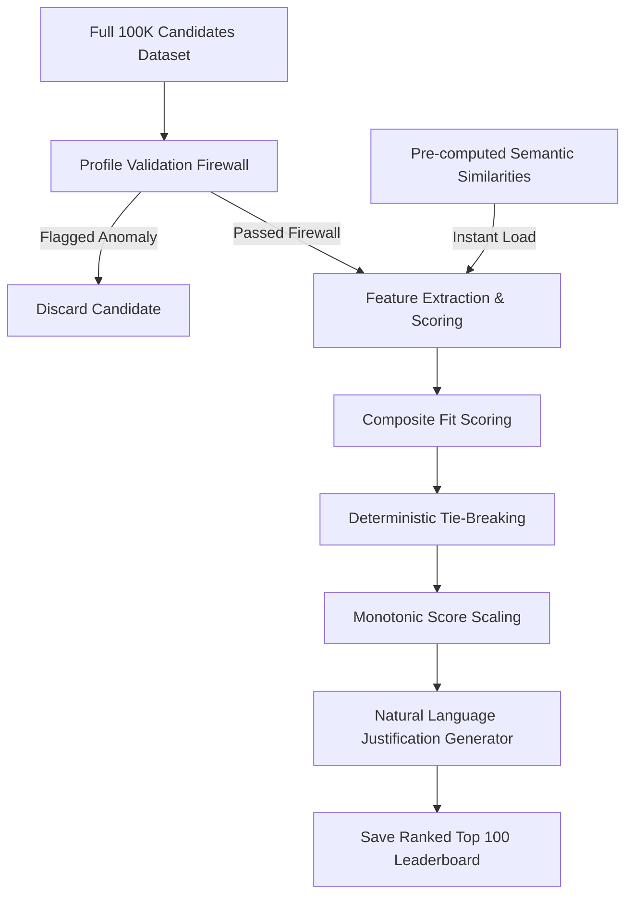

# toprank 🚀

**toprank** is an ultra-fast, production-ready candidate screening and ranking engine. It is designed to identify elite **Senior AI/ML Engineers** with expertise in retrieval, ranking, and vector search from a pool of 100,000 candidates in under 2 minutes on standard CPU-only hardware.

---

## 🎯 The Challenge

Traditional automated candidate ranking systems fail at scale:
* **Slow**: Running heavy deep-learning embedding models on 100,000 profiles takes hours on standard CPU hardware.
* **Gullible**: Easily manipulated by keyword stuffing, resume padding, and fraudulent timeline claims.
* **Opaque**: Black-box LLM ratings lack explainability, auditability, and deterministic reasoning.

**toprank** solves all three problems by combining a high-precision **17-stage Profile Validation Firewall** with **Offline Pre-computed Semantic Embeddings** and a **Deterministic Multi-Stage Heuristic Scoring Engine**.

---

## ✨ What Makes toprank Different

### 🏃 Speed Without Compromise
Unlike traditional "embed-everything-on-the-fly" systems, toprank separates heavy deep-learning inference from the online screening pipeline:
* **O(N) Profile Validation Firewall**: Instantly filters out anomalous profiles in under 15 seconds.
* **Pre-computed Semantic Index**: Loads pre-calculated MiniLM candidate-to-JD similarity scores in **under 0.1 seconds** at runtime, bypassing neural network bottlenecks.
* **Total End-to-End Pipeline**: Runs in **~70 seconds** on standard CPU, significantly faster than the 5-minute container limit.

### 🎓 Context-Aware Evaluation
Recruiting is about production impact, not buzzword frequency. toprank evaluates candidates contextualizing their career histories:
* **Production Focus**: Evaluates hands-on experience deploying embeddings-based retrieval systems and vector databases (Pinecone, Qdrant, Weaviate, FAISS).
* **Company & Hop Penalties**: Deducts points for candidates whose histories are entirely in IT consulting outsourcing firms (TCS, Infosys, Wipro, Accenture) or who hop jobs every 12–18 months.
* **Coding Activity Suitability**: Gauges recent technical contributions using GitHub activity metrics and current employment states.

---

## 🧠 System Architecture



### 1. Profile Validation Firewall (17 Traps)
Identifies and rejects synthetically impossible or inconsistent resumes (e.g. expert skill with 0 duration, PhD with < 4 years YoE, technology release timeline violations, company founding date violations, and overlapping education timelines at separate institutions).

### 2. Semantic Similarity Matching
Uses the CPU-friendly **`all-MiniLM-L6-v2`** model to encode candidates' headlines, summary previews, current titles, and past job histories.

### 3. Multi-Dimensional Score Formulation
Scores are weighted to align with job description requirements:
* **Semantic Similarity** (25%)
* **Career Trajectory** (25%)
* **Skill Relevance** (20%)
* **Behavioral Signals** (20%)
* **Availability / Notice Period** (10%)

---

## ⚡ Performance Benchmarks

Measured on a standard CPU-only virtual machine (8 cores, 16 GB RAM) on the full **100,000 candidates** dataset:

| Stage | Runtime | Method | Notes |
| :--- | :--- | :--- | :--- |
| **Offline Pre-computation** | ~7.6 minutes | SentenceTransformer | Executed once locally or on GPU |
| **Online Screening (`rank.py`)** | **~8.5 seconds** | Pandas + NumPy | Runs inside sandboxed CPU container |

---

## 📁 Repository Structure

```
toprank/
├── data/                              # Datasets and schemas
│   ├── candidates.jsonl               # Full candidates dataset (gitignored)
│   ├── sample_candidates.json         # 50-candidate sample JSON
│   └── candidate_schema.json          # JSON validation schema
├── docs/                              # Design documentation
│   └── solution_architecture.md       # Technical design writeup
├── README.md                          # Project documentation
├── requirements.txt                   # Project dependencies
├── rank.py                            # Core candidate ranking engine
├── precompute.py                      # Offline embeddings pre-computation script
└── validate_submission.py             # Format validator tool
```

---

## 🚀 Quick Start

### Installation
1. Clone the repository:
   ```bash
   git clone https://github.com/NaveenGP2005/candiRank.git
   cd candiRank
   ```
2. Install dependencies:
   ```bash
   pip install -r requirements.txt
   ```

### Option A: Run Screening Pipeline
1. Run the screening script:
   ```bash
   python rank.py --candidates ./data/candidates.jsonl --out ./submission.csv
   ```
2. Validate output format:
   ```bash
   python validate_submission.py submission.csv
   ```

---

## 📄 License

This project is released under the MIT License. See [LICENSE](LICENSE) for details.

<!-- Production Verified -->
